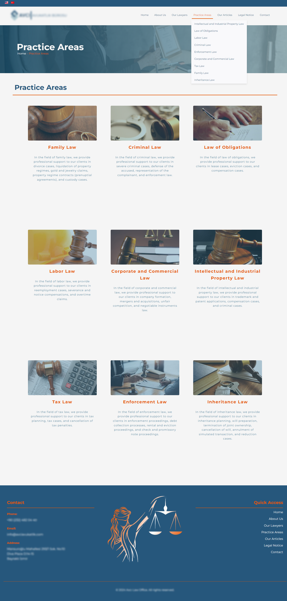

# Legal Services Website

This repository contains the presentation of a legal services website developed for a law firm. The website showcases practice areas, lawyer profiles, articles, and contact information. This README serves to describe the structure, features, and technologies used without sharing the full source code to maintain privacy.

## Live Website
The live website is hosted privately.

## Project Overview

The legal services website is a multilingual, responsive site designed for a law firm. It offers both English and Turkish versions of the content. The website features include:
- Responsive design with a sticky navbar.
- Foldable navigation menu for mobile devices.
- Article carousel for highlighting legal articles.
- Comprehensive lawyer profiles.
- Detailed descriptions of practice areas.
- Contact information with an embedded map.

## Technologies Used
- **HTML5**: Structure of the pages, including sections for practice areas, lawyer profiles, articles, and contact information.
- **CSS3**: Custom styling for the layout, responsiveness, and interactive elements such as hover effects and sticky navigation.
- **JavaScript (Vanilla & jQuery)**: Used for interactivity, including the sticky navbar, mobile navigation toggle, article carousel, and dynamic content loading.
- **cPanel**: Used for hosting the live version of the website.

## Key Features

### Sticky Navbar
The website uses a sticky navbar that remains fixed at the top of the page when scrolling. This improves navigation and user experience.

### Responsive Design
The website is fully responsive and includes a foldable hamburger menu for mobile devices to ensure optimal viewing on all screen sizes.

### Article Carousel
The homepage features a carousel that highlights various legal articles. Articles are dynamically loaded using JavaScript from a JSON file.

### Practice Areas
The website provides detailed information on the various areas of legal practice, such as Family Law, Criminal Law, Intellectual Property, and more. These sections are visually enhanced with custom images and hover effects.

### Lawyer Profiles
The profiles of the firm's lawyers include pictures and brief bios, showcasing their expertise and experience in different fields of law.

### Contact Information
The contact page features the firm's address, phone number, and email, as well as an embedded Google Map for easy navigation.

## Screenshots

### Homepage

### About Us

### Our Lawyers

### Practice Areas

### Articles

### Contact

### Legal Notice

## Files Included in the Project

- **HTML Files**:
  - `index.html`: Homepage with an introduction to the firm, practice areas, and featured articles.
  - `about.html`: Overview of the firm's history and mission.
  - `our-lawyers.html`: Profiles of the lawyers working at the firm.
  - `practice-areas.html`: Detailed descriptions of the firm's legal services.
  - `articles.html`: List of the legal articles published by the firm.
  - `contact.html`: Contact information and an embedded Google Map.
  - `legal-warning.html`: Legal disclaimer and terms of use.

- **CSS Files**:
  - `style.css`: Contains all the styling for the website, including responsive design, sticky navbar, and hover effects.

- **JavaScript Files**:
  - `scripts.js`: JavaScript functionalities including the sticky navbar, article carousel, mobile navigation, and dynamic content loading.

## How to Use

The source code remains private to protect sensitive information. For inquiries about the website or its development, feel free to contact the developer.

## Developer
This website was developed by **Turhan Temizel**.

- **LinkedIn**: [Turhan Temizel](https://www.linkedin.com/in/turhan-temizel-30689825b)
- **GitHub**: [Turhan Temizel](https://github.com/TurhanT)
- **Email**: [turhantemizel@gmail.com](mailto:turhantemizel@gmail.com)